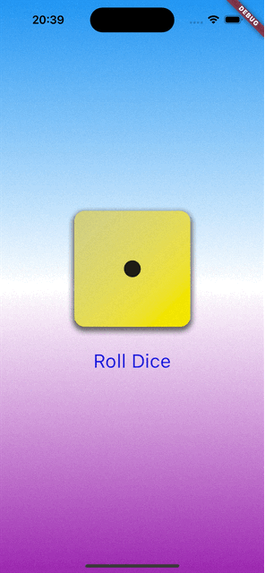

# roll_dice_app

A sample Flutter project based on the Udemy course [Flutter & Dart - The Complete Guide [2024 Edition]](https://www.udemy.com/course/fluhttps://www.udemy.com/course/learn-flutter-dart-to-build-ios-android-apps/).

NOTE - The app is configured for and tested on iOS only.

## What is in This Project?

* Core Flutter and Dart concepts for building a Flutter app
* How to use Flutter Stateful Widgets
* How to use Flutter Stateless Widgets
* How to use Flutter Material Components
* How to use Flutter Packages
* How to generate random numbers in Dart
* How to add image assets to Flutter app

## Installed Packages

None

## Additional Resources

None